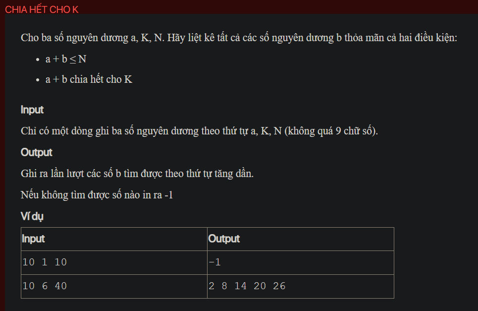

## py01014

- [README.md](README.md)
- [image.png](image.png)
- [input.txt](input.txt)
- [output.txt](output.txt)
- [py01014.py](py01014.py)
- [py01014_1.py](py01014_1.py)
- [py01014_2.py](py01014_2.py)
