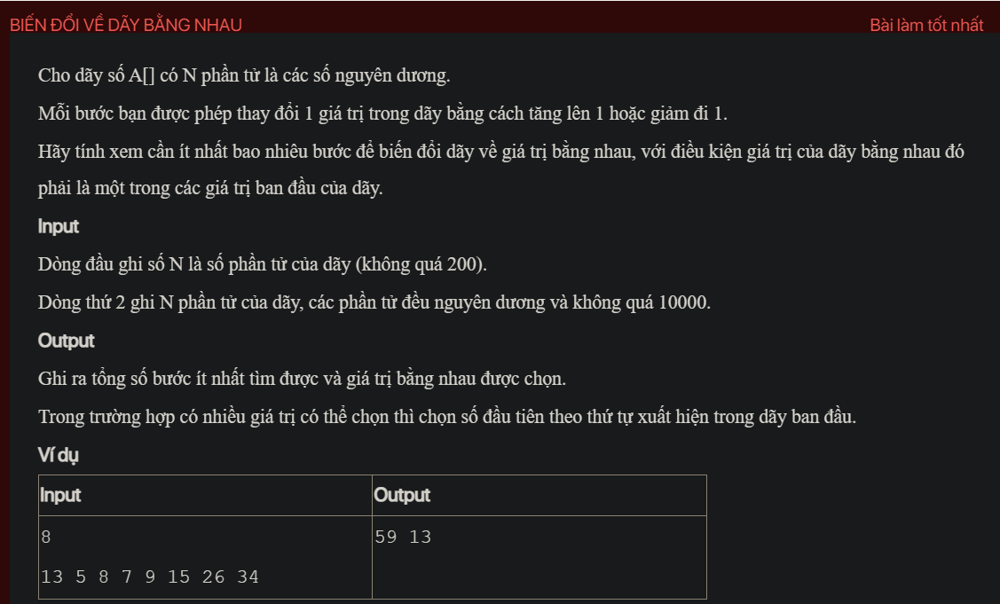

## py02011

- [README.md](README.md)
- [input.txt](input.txt)
- [output.txt](output.txt)
- [py02011.py](py02011.py)
To solve this problem, we need to transform all elements of the array to be equal to one of the values in the array, with the minimum number of steps. Each step consists of either increasing or decreasing an element by 1.

### Steps:

1. **Read Input**:
   - Read the number of elements \( N \).
   - Read the array \( A \) of \( N \) integers.

2. **Calculate Steps for Each Target**:
   - For each unique value in the array, calculate the total number of steps required to transform all elements to that value.
   - Keep track of the minimum number of steps and the corresponding target value.

3. **Output the Result**:
   - Print the minimum number of steps and the corresponding target value.

### Example:

Given the input:
```
8
13 5 8 7 9 15 26 34
```

The output should be:
```
59 13
```

### Code:

Here's the Python code to solve the problem:

```python
def min_steps_to_equalize(arr):
    unique_values = list(set(arr))
    min_steps = float('inf')
    best_value = None
    
    for target in unique_values:
        steps = sum(abs(x - target) for x in arr)
        if steps < min_steps:
            min_steps = steps
            best_value = target
        elif steps == min_steps:
            # If steps are the same, choose the first occurrence in the original array
            if arr.index(target) < arr.index(best_value):
                best_value = target
    
    return min_steps, best_value

def main():
    import sys
    input = sys.stdin.read
    data = input().strip().split()
    
    N = int(data[0])
    arr = list(map(int, data[1:N+1]))
    
    min_steps, best_value = min_steps_to_equalize(arr)
    print(min_steps, best_value)

if __name__ == '__main__':
    main()
```

### Explanation:

1. **min_steps_to_equalize Function**:
   - Takes the array `arr` as input.
   - Extracts the unique values from the array.
   - Initializes `min_steps` to infinity and `best_value` to `None`.
   - For each unique value in the array:
     - Calculates the total number of steps required to transform all elements to that value.
     - Updates `min_steps` and `best_value` if the current number of steps is less than the previous minimum.
     - If the number of steps is the same, chooses the value that appears first in the original array.
   - Returns the minimum number of steps and the corresponding target value.

2. **main Function**:
   - Reads the input data.
   - Extracts the number of elements \( N \) and the array \( A \).
   - Calls `min_steps_to_equalize` to get the minimum number of steps and the best value.
   - Prints the result.

This approach ensures that the code correctly calculates the minimum number of steps required to equalize the array to one of its original values, and handles the case where multiple values have the same number of steps by choosing the first occurrence.