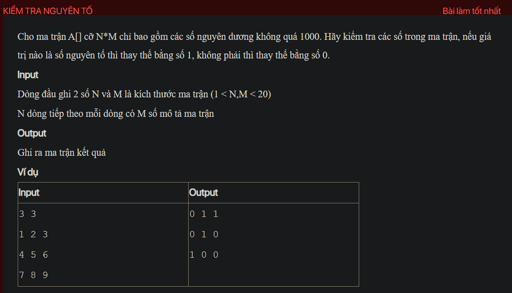

## py02031

- [README.md](README.md)
- [image.png](image.png)
- [input.txt](input.txt)
- [output.txt](output.txt)
- [py02031.py](py02031.py)
- [py02031_1.py](py02031_1.py)
- [py02031_2.py](py02031_2.py)
- [py02031_3.py](py02031_3.py)
