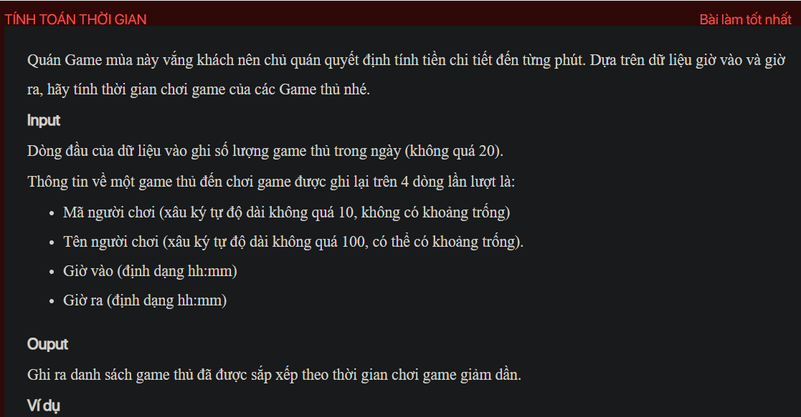
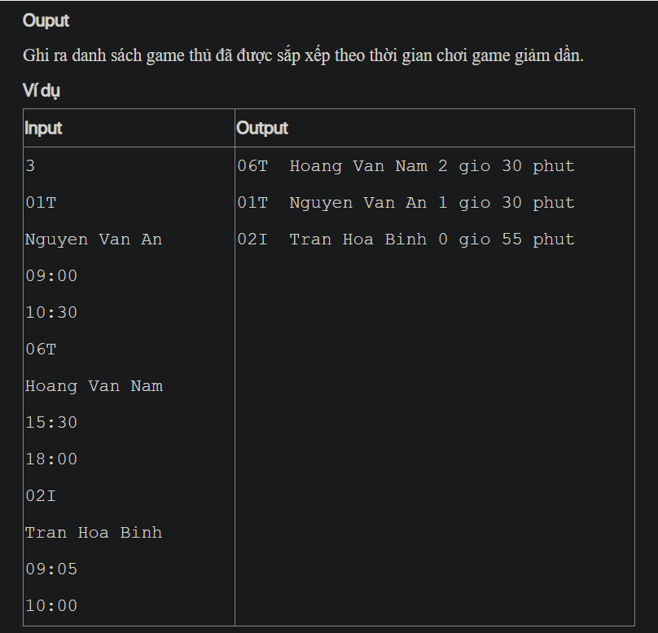

## py04021

- [README.md](README.md)
- [image-1.png](image-1.png)
- [image.png](image.png)
- [input.txt](input.txt)
- [output.txt](output.txt)
- [py04021.py](py04021.py)
- [py04021_1.py](py04021_1.py)
