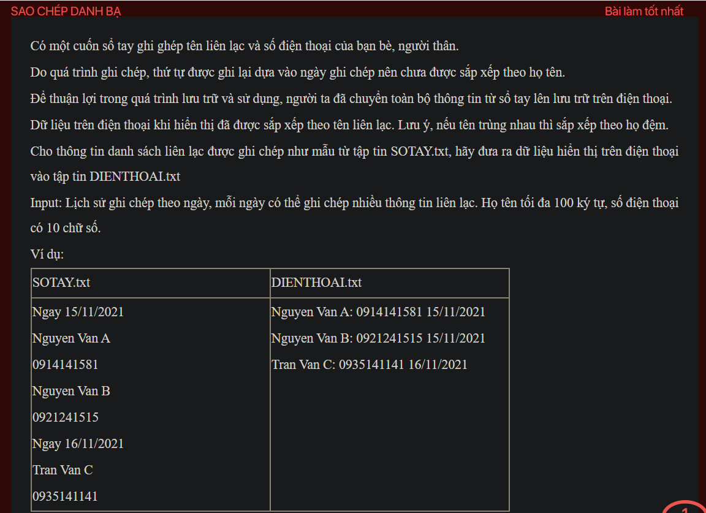

## pykt075

- [DIENTHOAI.txt](DIENTHOAI.txt)
- [README.md](README.md)
- [SOTAY.txt](SOTAY.txt)
- [image.png](image.png)
- [input.txt](input.txt)
- [output.txt](output.txt)
- [pykt075.py](pykt075.py)
