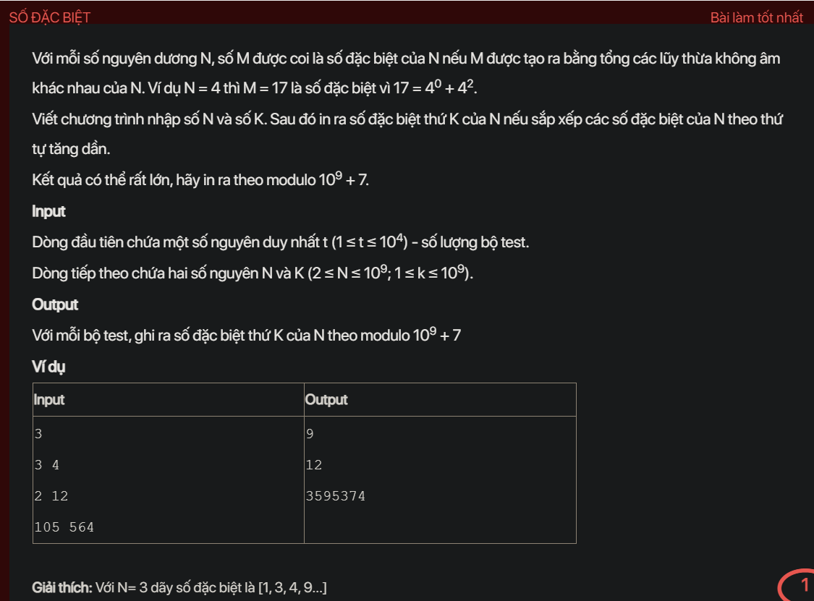

## pykt087

- [README.md](README.md)
- [input.txt](input.txt)
- [output.txt](output.txt)
- [pykt087.py](pykt087.py)
To solve this problem, we need to generate the K-th special number of N, where a special number is defined as the sum of distinct non-negative powers of N. Given the constraints, we need an efficient way to generate these numbers and find the K-th one.

### Steps:

1. **Understanding Special Numbers**:
   - Special numbers of N are sums of distinct non-negative powers of N.
   - For example, if \( N = 3 \), the special numbers are \( 1, 3, 4, 9, 10, 12, 13, 27, \ldots \).

2. **Binary Representation**:
   - Each special number can be represented as a binary number where each bit represents whether a particular power of N is included in the sum.
   - For example, \( 4 \) (which is \( 3^1 + 3^0 \)) can be represented as \( 11_2 \).

3. **Generating the K-th Special Number**:
   - The K-th special number can be generated by interpreting the binary representation of \( K \) as the inclusion of powers of N.
   - For example, if \( K = 4 \), its binary representation is \( 100_2 \), which corresponds to \( 3^2 \).

4. **Modulo Operation**:
   - Since the result can be very large, we need to take the result modulo \( 10^9 + 7 \).

### Example:

Given the input:
```
3
3 4
2 12
105 564
```

- For \( N = 3 \) and \( K = 4 \):
  - The binary representation of 4 is \( 100_2 \).
  - The 4th special number is \( 3^2 = 9 \).

- For \( N = 2 \) and \( K = 12 \):
  - The binary representation of 12 is \( 1100_2 \).
  - The 12th special number is \( 2^3 + 2^2 = 8 + 4 = 12 \).

### Code:

Here's the Python code to solve the problem:

```python
MOD = 10**9 + 7

def special_number(N, K):
    result = 0
    power = 1
    while K > 0:
        if K % 2 == 1:
            result = (result + power) % MOD
        power = (power * N) % MOD
        K //= 2
    return result

def main():
    import sys
    input = sys.stdin.read
    data = input().strip().split()
    
    t = int(data[0])
    index = 1
    results = []
    
    for _ in range(t):
        N = int(data[index])
        K = int(data[index + 1])
        index += 2
        results.append(special_number(N, K))
    
    for result in results:
        print(result)

if __name__ == '__main__':
    main()
```

### Explanation:

1. **special_number Function**:
   - This function calculates the K-th special number for a given N.
   - It uses the binary representation of K to determine which powers of N to include in the sum.
   - It iterates through the bits of K, adding the corresponding power of N to the result if the bit is set.
   - The result is taken modulo \( 10^9 + 7 \) to handle large numbers.

2. **main Function**:
   - Reads the input.
   - For each test case, reads N and K, and calculates the K-th special number using the `special_number` function.
   - Prints the results for all test cases.

This approach ensures that the code efficiently calculates the K-th special number for large values of N and K, and handles the modulo operation to keep the results manageable.