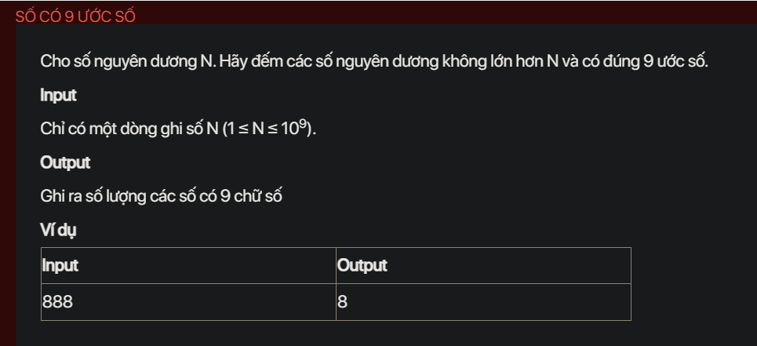

## pykt088
### Key Insight:
### Steps:
### Example:
### Code:
### Explanation:

- [README.md](README.md)
- [input.txt](input.txt)
- [output.txt](output.txt)
- [pykt088.py](pykt088.py)
Sure, let's break down the code step-by-step and explain how it works to count the number of special numbers with exactly 9 divisors up to \( n \).

### Problem Recap:
We need to count the number of positive integers less than or equal to \( n \) that have exactly 9 divisors. A number has exactly 9 divisors if and only if it can be expressed in one of the following forms:
1. \( p^8 \) where \( p \) is a prime number.
2. \( p^2 \times q^2 \) where \( p \) and \( q \) are distinct prime numbers.

### Code Explanation:

#### 1. Sieve Function:
The `sieve` function generates the smallest prime factor for each number up to a given limit using a modified Sieve of Eratosthenes.

```python
def sieve(limit):
    a = [i for i in range(limit + 1)]
    i = 2
    while i * i <= limit:
        if a[i] == i:
            for j in range(i * i, limit + 1, i):
                if a[j] == j:
                    a[j] = i
        i += 1
    return a
```

- **Initialization**: 
  - `a = [i for i in range(limit + 1)]` creates a list where each index initially holds its own value.
- **Sieve of Eratosthenes**:
  - The outer loop runs while \( i^2 \leq \text{limit} \).
  - If `a[i]` is still \( i \), it means \( i \) is a prime number.
  - The inner loop marks the multiples of \( i \) with \( i \) as their smallest prime factor.
- **Return**:
  - The function returns the list `a` where each index contains the smallest prime factor of that number.

#### 2. Count Special Numbers Function:
The `count_special_numbers` function counts the numbers of the form \( p^8 \) and \( p^2 \times q^2 \) that are less than or equal to \( n \).

```python
def count_special_numbers(n):
    s = 0
    l = int(n ** 0.5)
    a = sieve(l)
    
    for i in range(2, l + 1):
        p = a[i]
        q = a[i // a[i]]
        if p * q == i and q != 1 and p != q:
            s += 1
        elif a[i] == i:
            if i ** 8 <= n:
                s += 1
    return s
```

- **Initialization**:
  - `s = 0` initializes the count of special numbers.
  - `l = int(n ** 0.5)` calculates the square root of \( n \) to limit the range of numbers we need to check.
  - `a = sieve(l)` generates the smallest prime factors up to \( l \).

- **Counting Special Numbers**:
  - The loop iterates through numbers from 2 to \( l \).
  - For each number \( i \):
    - `p = a[i]` gets the smallest prime factor of \( i \).
    - `q = a[i // a[i]]` gets the smallest prime factor of \( i / p \).
    - **Check for \( p^2 \times q^2 \)**:
      - If \( p \times q = i \) and \( q \neq 1 \) and \( p \neq q \), it means \( i \) can be expressed as \( p^2 \times q^2 \).
      - Increment the count `s`.
    - **Check for \( p^8 \)**:
      - If \( a[i] = i \), it means \( i \) is a prime number.
      - If \( i^8 \leq n \), it means \( i^8 \) is a valid special number.
      - Increment the count `s`.

- **Return**:
  - The function returns the count `s` of special numbers.

#### 3. Main Function:
The `main` function reads the input, calls the `count_special_numbers` function, and prints the result.

```python
def main():
    n = int(input())
    result = count_special_numbers(n)
    print(result)

if __name__ == '__main__':
    main()
```

- **Input**:
  - Reads the input \( n \).
- **Processing**:
  - Calls `count_special_numbers(n)` to get the count of special numbers.
- **Output**:
  - Prints the result.

### Summary:
- The code uses a modified Sieve of Eratosthenes to find the smallest prime factors up to \( \sqrt{n} \).
- It then counts numbers of the form \( p^8 \) and \( p^2 \times q^2 \) that are less than or equal to \( n \).
- The main function handles input and output.

This approach ensures that the code efficiently counts the numbers with exactly 9 divisors up to \( n \).