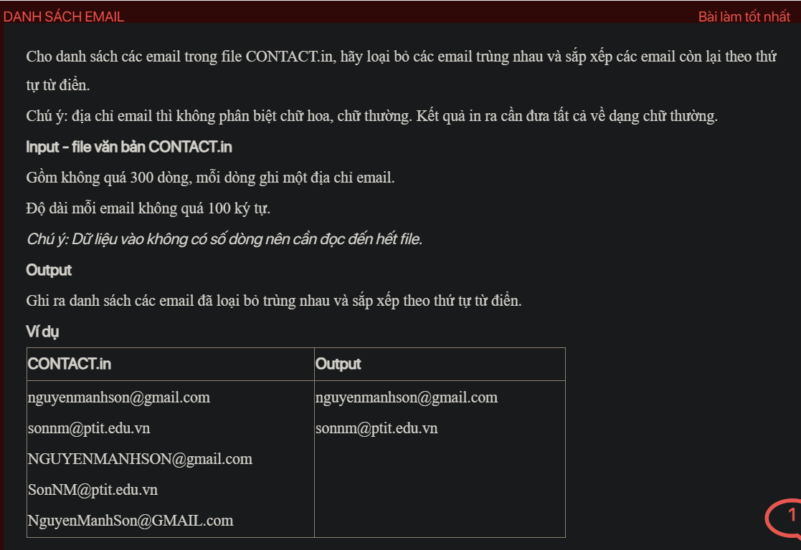

## pykt090

- [CONTACT.in](CONTACT.in)
- [image.png](image.png)
- [input.txt](input.txt)
- [output.txt](output.txt)
- [pykt090.py](pykt090.py)
- [pykt090_1.py](pykt090_1.py)
- [README.md](README.md)
