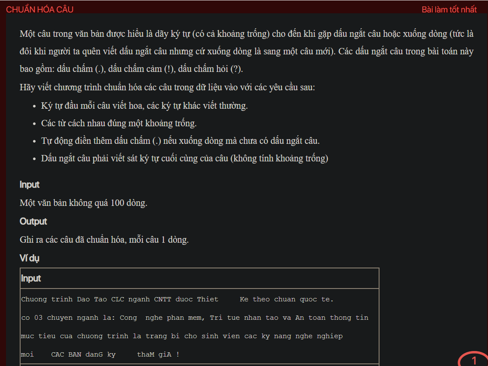
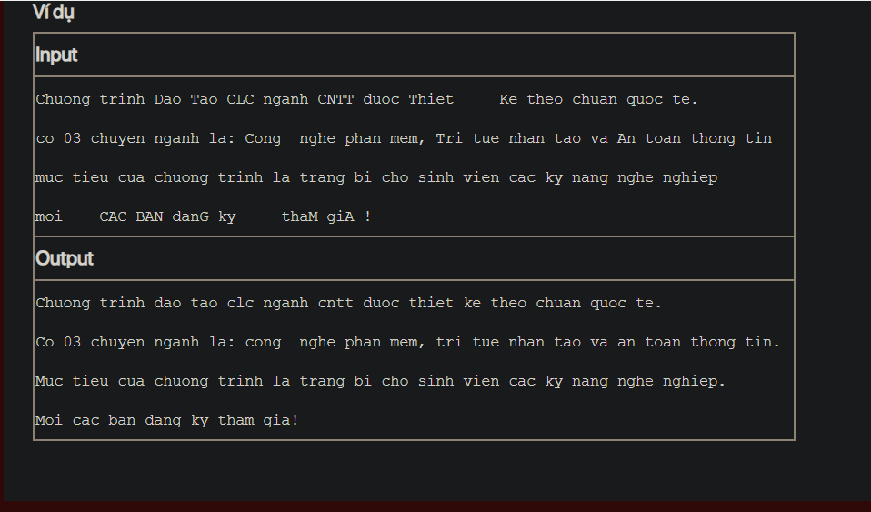

## pykt097

- [README.md](README.md)
- [image-1.png](image-1.png)
- [image.png](image.png)
- [input.txt](input.txt)
- [output.txt](output.txt)
- [pykt097.py](pykt097.py)
- [pykt097_1.py](pykt097_1.py)
