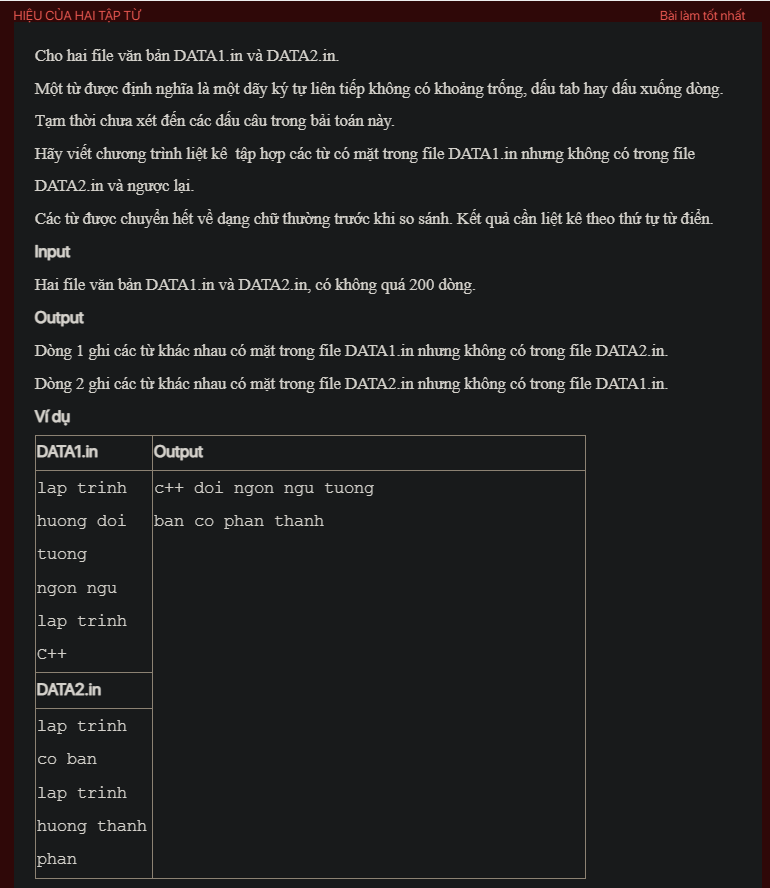

## pykt099

- [DATA1.in](DATA1.in)
- [DATA2.in](DATA2.in)
- [README.md](README.md)
- [image.png](image.png)
- [input.txt](input.txt)
- [output.txt](output.txt)
- [pykt099.py](pykt099.py)
- [pykt099_1.py](pykt099_1.py)
